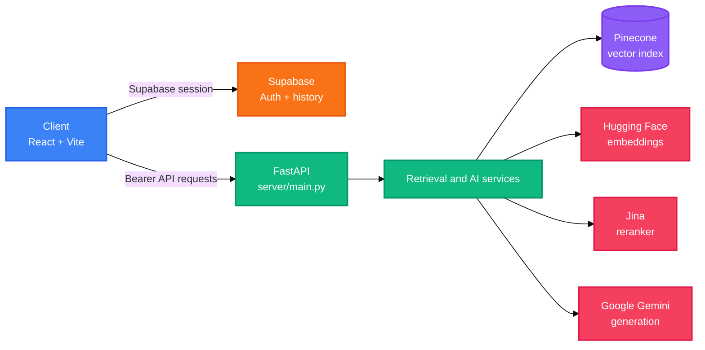

# AI Sensei

AI Sensei is a study assistant with a React frontend and a FastAPI backend.
Users authenticate with Supabase, upload subject PDFs, and ask questions against retrieved context from Pinecone.


## Scope

This README documents only:

<div align="right">

English

</div>

<h1 align="center">AI Sensei</h1>
<p align="center">
	<strong>Study assistant for authenticated PDF-based questions and streamed AI answers.</strong>
	<br />
	<em>React · FastAPI · Supabase · Pinecone · Gemini</em>
</p>

<p align="center">
	<a href="#quick-start"></a>
	<a href="#license"></a>
</p>

<p align="center">
	
	
	
	
	
	
</p>

## Features

| Feature | Description |
|---|---|
| PDF question answering | Upload subject PDFs, embed their content, and ask questions scoped to the authenticated user and subject. |
| Streaming responses | Answers are streamed from the FastAPI backend to the React chat interface. |
| Retrieval and reranking | Pinecone retrieves candidate chunks, then Jina reranks the results before generation. |
| Session history | Users can create sessions and retrieve persisted message history from Supabase. |
| Supabase authentication | The client supports email/password authentication and Google OAuth through Supabase. |
| Study-focused rendering | The client renders Markdown, GitHub Flavored Markdown, and mathematical notation with KaTeX. |


## Quick Start

The following commands configure both applications for local development.

### Prerequisites

- Python 3.14, as specified by `.python-version`
- Node.js and npm
- Supabase, Pinecone, Google Gemini, Hugging Face, and Jina credentials

### Backend

```powershell
python -m venv .venv
.\.venv\Scripts\Activate.ps1
pip install -r server/requirements.txt
```

### Configure

Create `server/.env`:

```dotenv
PINECONE_API_KEY=your-pinecone-api-key
PINECONE_INDEX_NAME=your-pinecone-index
GOOGLE_API_KEY=your-google-api-key
HF_TOKEN=your-huggingface-token
SUPABASE_URL=https://your-project-ref.supabase.co
SUPABASE_SECRET_KEY=your-supabase-secret-key
JINA_API_KEY=your-jina-api-key
```

Create `client/.env` from `client/.env.example` and set the Supabase and backend values, then start each application in a separate terminal:

```powershell
cd server
uvicorn main:app --reload
```

```powershell
cd client
npm install
npm run dev
```

The API is available at `http://localhost:8000`. Vite serves the client at its reported local development URL, normally `http://localhost:5173`.

## Usage

### Ask a question

The client sends multipart form data and includes the Supabase access token as a bearer token. The response body is consumed as a text stream.

```typescript
await askQuestion(
	'What is diabetes?',
	'Biology',
	sessionId,
	(chunk) => {
		setMessages((previous) =>
			previous.map((message) =>
				message.id === aiMsgId
					? { ...message, content: message.content + chunk }
					: message,
			),
		)
	},
)
```

### Upload PDFs

```typescript
await uploadPdfs(files, 'Biology')
```

### Create a session

```typescript
const { session_id } = await createSession('Biology')
```

## Architecture



## Configuration

### Backend: `server/.env`

| Variable | Description | Default |
|---|---|---|
| `PINECONE_API_KEY` | Pinecone API credential. | Required |
| `PINECONE_INDEX_NAME` | Pinecone index used for document vectors. | Required |
| `GOOGLE_API_KEY` | Google Gemini API credential. | Required |
| `HF_TOKEN` | Hugging Face token used for embeddings. | Required |
| `SUPABASE_URL` | Supabase project URL. | Required |
| `SUPABASE_SECRET_KEY` | Server-side Supabase credential. | Required |
| `JINA_API_KEY` | Jina reranking API credential. | Required |

### Client: `client/.env`

| Variable | Description | Default |
|---|---|---|
| `VITE_SUPABASE_URL` | Supabase project URL exposed to the Vite client. | Required |
| `VITE_SUPABASE_ANON_KEY` | Supabase anonymous key exposed to the Vite client. | Required |
| `VITE_API_BASE_URL` | FastAPI base URL. | `http://localhost:8000` |

## API

All application routes except `GET /health` require `Authorization: Bearer <supabase_access_token>`.

| Method | Path | Description | Auth |
|---|---|---|---|
| GET, HEAD | `/health` | Return API health status. | No |
| POST | `/upload_pdf/` | Validate a subject, process uploaded PDFs, and store their vectors. | Bearer |
| POST | `/ask/` | Condense, retrieve, rerank, and stream an answer for a session. | Bearer |
| GET | `/uploaded_files/` | List uploaded files for a subject. | Bearer |
| POST | `/chat_sessions/` | Create a chat session for a subject. | Bearer |
| GET | `/chat_sessions/` | List the authenticated user’s chat sessions. | Bearer |
| GET | `/chat_sessions/{session_id}/history` | Return message history for a session. | Bearer |

Supported subjects include Physics, Chemistry, Biology, Math, Bangla, English, History, Geography, Philosophy, Literature, Social Science, and Religion.

## Project Structure

```text
.
├── client/                    # React and Vite client application
│   ├── src/
│   │   ├── components/        # Chat, upload, session, and notification UI
│   │   ├── contexts/          # Supabase authentication context
│   │   ├── lib/               # API, constants, and Supabase clients
│   │   └── pages/             # Authentication and chat pages
│   ├── public/                # Static client assets
│   ├── package.json           # npm scripts and dependencies
│   └── vercel.json            # SPA rewrite configuration
├── server/                    # FastAPI application and retrieval pipeline
│   ├── api/                   # HTTP route handlers
│   ├── config/                # Models, prompts, subjects, and retrieval settings
│   ├── middlewares/           # Exception middleware
│   ├── services/              # Authentication, LLM, vector, quota, and history services
│   ├── tests/                 # Server test scripts
│   ├── main.py                # FastAPI application entry point
│   └── requirements.txt       # Python dependencies
├── pyproject.toml             # Root Python project metadata
└── README.md                  # Project documentation
```

## Tech Stack

| Layer | Technologies |
|---|---|
| Client | React 19, TypeScript, Vite, React Router, Supabase JS |
| Client rendering | React Markdown, remark-gfm, remark-math, rehype-katex, KaTeX |
| Backend | Python 3.14, FastAPI, Uvicorn, Pydantic, SlowAPI |
| AI pipeline | LangChain, Google Gemini, Hugging Face embeddings, Jina reranker |
| Data services | Pinecone vector index and Supabase authentication/history storage |
| Document processing | Python multipart uploads and pypdf |

## Development Commands

```powershell
cd client
npm run lint
npm run build
npm run preview
```

Server test scripts are located in `server/tests/` and can be run individually with Python when their required services and credentials are available.

## Deployment

The client includes `client/vercel.json`, which rewrites all routes to `index.html` for SPA navigation. Configure the Vercel project root as `client/`, use `npm run build` as the build command, and set the three `VITE_*` variables from the client configuration table.

The repository does not include a backend deployment manifest. Deploy the FastAPI application with an external Python service and run it with:

```text
uvicorn main:app --host 0.0.0.0 --port <PORT>
```

Set `VITE_API_BASE_URL` to the deployed API URL rather than `localhost`.

## Contributing

1. Fork the repository.
2. Create a feature branch.
3. Make focused changes and run the relevant client or server checks.
4. Open a pull request with a concise description of the change.

## License

This project is licensed under the MIT License - see the [LICENSE](LICENSE) file for details.

