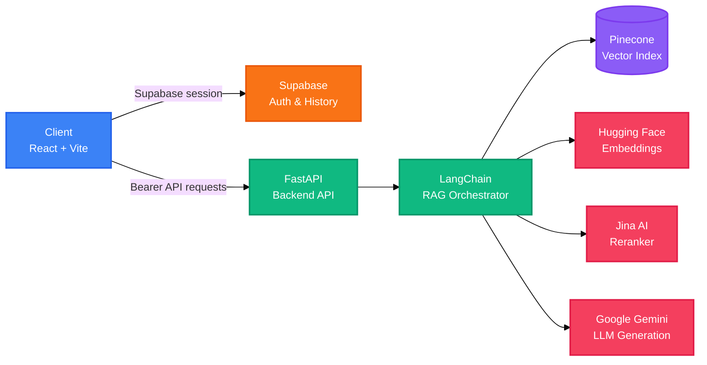

<h1 align="center">AI Sensei</h1>
<p align="center">
  <strong>Study assistant for authenticated PDF-based questions and streamed AI answers.</strong>
  <br />
  <em>React · FastAPI · LangChain · Pinecone · Google Gemini · Supabase</em>
</p>

<p align="center">
  <a href="#quick-start"></a>
  <a href="LICENSE"></a>
</p>

<p align="center">
  
  
  
  
  
  
</p>

---

## Features

| Feature | Description |
|---|---|
| PDF Question Answering | Upload subject PDFs, chunk content with LangChain, and ask questions scoped to user and subject. |
| Streaming Responses | Stream answers from the FastAPI backend directly to the React interface using LangChain streaming. |
| LangChain RAG Pipeline | Orchestrate prompt templates, document formatters, retrievers, and Gemini LLM via LangChain Expression Language (LCEL). |
| Retrieval and Reranking | Retrieve candidate document chunks from Pinecone and rerank them using Jina AI prior to answer generation. |
| Session History | Persist and retrieve conversation history per subject session backed by Supabase. |
| Supabase Authentication | Secure API endpoints with JWT verification supporting email/password and Google OAuth. |
| Math and Markdown Rendering | Render LaTeX mathematical notation, tables, and formatted study notes with KaTeX and Markdown. |


## Quick Start

### Prerequisites

- Python 3.14 (`.python-version`)
- Node.js 18+ and npm
- Credentials for Supabase, Pinecone, Google Gemini, Hugging Face, and Jina

### Backend Setup

```powershell
python -m venv .venv
.\.venv\Scripts\Activate.ps1
pip install -r server/requirements.txt
```

### Configuration

Create `server/.env`:

```dotenv
PINECONE_API_KEY=your-pinecone-api-key
PINECONE_INDEX_NAME=your-pinecone-index
GOOGLE_API_KEY=your-google-api-key
HF_TOKEN=your-huggingface-token
SUPABASE_URL=https://your-project-ref.supabase.co
SUPABASE_SECRET_KEY=your-supabase-secret-key
JINA_API_KEY=your-jina-api-key
```

Create `client/.env`:

```dotenv
VITE_SUPABASE_URL=https://your-project-ref.supabase.co
VITE_SUPABASE_ANON_KEY=your-supabase-anon-key
VITE_API_BASE_URL=http://localhost:8000
```

### Run Locally

Start the backend:

```powershell
cd server
uvicorn main:app --reload
```

Start the client in a separate terminal:

```powershell
cd client
npm install
npm run dev
```

The API is available at `http://localhost:8000` and the web interface runs at `http://localhost:5173`.

## Architecture



## API Reference

All application endpoints except `GET /health` require `Authorization: Bearer <supabase_access_token>`.

| Method | Path | Description | Auth |
|---|---|---|---|
| `GET`, `HEAD` | `/health` | API health check. | Public |
| `POST` | `/upload_pdf/` | Upload, chunk, and index subject PDFs. | Bearer |
| `POST` | `/ask/` | Condense question, retrieve, rerank, and stream answer. | Bearer |
| `GET` | `/uploaded_files/` | List uploaded files for a subject. | Bearer |
| `POST` | `/chat_sessions/` | Create a new subject session. | Bearer |
| `GET` | `/chat_sessions/` | List all user chat sessions. | Bearer |
| `GET` | `/chat_sessions/{session_id}/history` | Fetch message history for a session. | Bearer |

Supported subjects: `Physics`, `Chemistry`, `Biology`, `Math`, `Bangla`, `English`, `History`, `Geography`, `Philosophy`, `Literature`, `Social Science`, and `Religion`.

## Configuration Reference

### Backend (`server/.env`)

| Variable | Description | Requirement |
|---|---|---|
| `PINECONE_API_KEY` | Pinecone API key | Required |
| `PINECONE_INDEX_NAME` | Pinecone vector index name | Required |
| `GOOGLE_API_KEY` | Google Gemini API key | Required |
| `HF_TOKEN` | Hugging Face inference token for embeddings | Required |
| `SUPABASE_URL` | Supabase project endpoint | Required |
| `SUPABASE_SECRET_KEY` | Supabase service secret key | Required |
| `JINA_API_KEY` | Jina AI reranking API key | Required |

### Frontend (`client/.env`)

| Variable | Description | Default |
|---|---|---|
| `VITE_SUPABASE_URL` | Supabase project URL | Required |
| `VITE_SUPABASE_ANON_KEY` | Supabase anonymous public key | Required |
| `VITE_API_BASE_URL` | FastAPI backend base URL | `http://localhost:8000` |

## Tech Stack

| Layer | Technologies |
|---|---|
| Client | React 19, TypeScript, Vite, React Router, Supabase JS |
| Client Rendering | React Markdown, remark-gfm, remark-math, rehype-katex, KaTeX |
| Backend | Python 3.14, FastAPI, Uvicorn, Pydantic, SlowAPI |
| AI & Orchestration | LangChain (Core, Community, Classic, Splitters), Google Gemini, Hugging Face, Jina AI |
| Vector & Storage | Pinecone (Vector Index), Supabase (PostgreSQL Auth & Chat History) |
| Document Processing | PyPDFLoader, RecursiveCharacterTextSplitter |

## Project Structure

```text
.
├── client/                    # React and Vite client application
│   ├── src/
│   │   ├── components/        # Chat, upload, session, and notification UI
│   │   ├── contexts/          # Supabase authentication context
│   │   ├── lib/               # API, constants, and Supabase clients
│   │   └── pages/             # Authentication and chat pages
│   ├── public/                # Static client assets
│   ├── package.json           # npm scripts and dependencies
│   └── vercel.json            # SPA rewrite configuration
├── server/                    # FastAPI application and retrieval pipeline
│   ├── api/                   # HTTP route handlers
│   ├── config/                # Models, prompts, subjects, and retrieval settings
│   ├── middlewares/           # Exception middleware
│   ├── services/              # Authentication, LLM, vector, quota, and history services
│   ├── tests/                 # Server test scripts
│   ├── main.py                # FastAPI application entry point
│   └── requirements.txt       # Python dependencies
├── pyproject.toml             # Root Python project metadata
└── README.md                  # Project documentation
```

## Development Commands

```powershell
cd client
npm run lint
npm run build
npm run preview
```

Server test scripts are located in `server/tests/` and can be run with Python once environment variables are configured.

## Deployment

### Frontend (Vercel)

The client is configured for Vercel deployment with `client/vercel.json`:
- **Root Directory**: `client`
- **Build Command**: `npm run build`
- **Output Directory**: `dist`
- **Environment Variables**: Configure `VITE_SUPABASE_URL`, `VITE_SUPABASE_ANON_KEY`, and `VITE_API_BASE_URL`.

### Backend

Deploy the FastAPI application using any container or Python service:

```powershell
uvicorn main:app --host 0.0.0.0 --port 8000
```

Set `VITE_API_BASE_URL` in the frontend to point to the deployed backend URL.

## Contributing

1. Fork the repository.
2. Create a feature branch (`git checkout -b feature/name`).
3. Make focused changes and run tests.
4. Open a pull request with a concise description of the changes.

## License

This project is licensed under the MIT License — see the [LICENSE](LICENSE) file for details.
